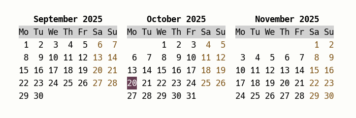

# Calcol



# A wrapper to colorize util-linux cal

Calcol is a wrapper around the **cal** command from **util-linux** that allows you
to display a colorized calendar. Since 2023, cal can be colorized:

https://github.com/util-linux/util-linux/issues/2053

but months and week headers cannot be customized separately, and colored headers
straddle separate months.

Calcol arguably looks a bit better, with months and week headers that can be
customized independently, and header backgrounds that do not straddle separate
months. Calcol also allows you to customize year numbers, and accepts terminal
colors in the 0-255 range instead of being limited to the 16 ANSI colors.

The difference between cal and calcol can be seen in the following screenshot,
in which cal comes first and calcol second:


TLDR: Use calcol only if you prefer its looks. Cal and calcol are equally easy
to configure.

# Dependencies

A POSIX system with **cal** and **awk**.

# Installation

1) Make calcol.sh executable (`chmod +x calcol.sh`) and copy it into your PATH.

2) Alias cal to calcol.sh in your .bashrc or equivalent:

```
alias cal='calcol.sh'
```

### Tip 1

If you want weeks to start on monday, use:

```
alias cal='calcol.sh -m'
```

as an aliasing command. If you want weeks to start on sunday, use:

```
alias cal='calcol.sh -s'
```

### Tip 2

If your version of cal is already configured with custom colors, please
remove or rename your **terminal-colors.d/cal.scheme** config file; otherwise
calcol won't function correctly, as it expects non-colorized text input from cal.

# Customization

Calcol can be customized via environment variables:

| Environment Variable | Default Value  |
|:---------------------|:---------------|
| CALCOL\_SAT          | Sat            |
| CALCOL\_SUN          | Sun            |
| CALCOL\_HEAD         | 0,2            |
| CALCOL\_MONTH        | 2,,b           |
| CALCOL\_WEEKEND      | 3              |
| CALCOL\_WEEKNUM      | 8              |
| CALCOL\_YEAR         | 2,,b           |
| CALCOL\_FOCUS        | 0,1            |

CALCOL\_SAT and CALCOL\_SUN should contain cal's abbreviations for Saturday and Sunday,
respectively. Their default values are "Sat" and "Sun", so leave them untouched if your
version of cal uses English. If your version of cal uses another language, however, you
should define CALCOL\_SAT and CALCOL\_SUN so that they equal the abbreviations actually
employed. In French, for example, these abbreviations are "Sa" and "Di", so you should
write the following in your .bashrc or equivalent:

```
    CALCOL_SAT=Sa
    export CALCOL_SAT

    CALCOL_SUN=Di
    export CALCOL_SUN
```

Getting these values right is important, because calcol uses them to detect calendar
settings and text positions to be colorized.

The other environment variables for calcol are used to customize colors. These variables
specify the colors for week headers, month names, weekend days, week numbers, year names,
and focus (i.e., the current day). The format for a custom color specification is:

```
    foreground,background,attribute
```

Foreground and background are optional color numbers from 0 to 255. The optional
attribute is either "b" (for bold) or "u" (for underline). Trailing commas can be
deleted (e.g., see the entry for CALCOL\_WEEKEND in the table above).

For example, CALCOL\_MONTH equals "2,,b" by default, meaning that month names
are colored green (ANSI color 2) and in bold ("b") with no background color. To
make month names appear in color 252, on background 140, and underlined, write
the following in your .bashrc or equivalent:

```
    CALCOL_MONTH=252,140,u
    export CALCOL_MONTH
```

# License

MIT


